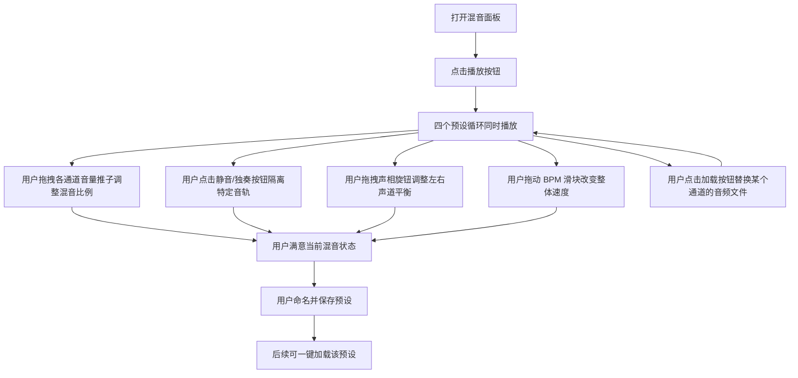

## 1. 产品概述

"多轨混音面板"是一个基于浏览器的虚拟音频混音台，模拟专业录音棚中混音控制台的核心功能。用户无需真实录音设备即可体验多轨混音的乐趣，适合音乐爱好者、初学者以及对音频制作感兴趣的人群。

- **解决的核心问题**：提供一个零门槛、即开即用的多轨混音体验，无需安装任何软件或硬件
- **目标用户**：音乐爱好者、DJ 入门者、想要理解混音概念的初学者
- **产品价值**：以直观的可视化界面降低音频混音的学习门槛，同时保持专业工具的操控感

## 2. 核心功能

### 2.1 用户角色

本项目为单用户工具型应用，无需用户注册或登录。

### 2.2 功能模块

1. **混音控制台主页面**：包含所有核心交互的单一页面应用

### 2.3 页面详情

| 页面名称 | 模块名称 | 功能描述 |
|---------|---------|---------|
| 混音控制台 | 多轨通道条 | 4 条音频通道，每条包含音量推子、静音按钮、独奏按钮、声相旋钮、音轨名称标签和电平表 |
| 混音控制台 | 全局传输控制 | 播放/停止按钮，控制所有音轨的同步播放与暂停 |
| 混音控制台 | BPM 调速滑块 | 全局速度控制滑块，调整所有循环片段的播放速度（范围 60-200 BPM） |
| 混音控制台 | 音频文件加载 | 每个通道支持从本地加载 WAV/MP3 文件替换预设循环片段 |
| 混音控制台 | 预设管理 | 保存当前混音状态（各轨音量、声相、BPM）并命名，支持一键加载已保存的预设 |
| 混音控制台 | 母带 EQ | 全局双段均衡器，提供低频增益和高频增益两个旋钮 |

## 3. 核心流程

## 4. 用户界面设计

### 4.1 设计风格

- **整体风格**：专业录音棚混音控制台风格，深色基调搭配暖色高亮
- **主色调**：深炭灰背景（#1a1a2e 至 #16213e），模拟调音台金属面板质感
- **强调色**：琥珀金（#e8a850）用于推子、旋钮和激活状态；红色（#e74c3c）用于静音和录音指示；绿色（#27ae60）用于电平表和独奏按钮
- **次级色**：冷灰蓝（#2d3a5c）用于通道条面板
- **字体**：标题使用 "Orbitron"（科技感展示字体），正文和控制标签使用 "Rajdhani"（清晰有力的无衬线字体）
- **推子设计**：垂直音量推子，带刻度标记，支持鼠标拖拽交互
- **旋钮设计**：圆形旋钮带角度指示线，支持鼠标拖拽旋转
- **按钮风格**：圆角矩形，带微妙的立体阴影和 hover 发光效果
- **布局风格**：横向排列的多条通道条（channel strip），顶部为全局控制栏，底部为预设管理区
- **动效**：推子和旋钮的操作带平滑过渡，播放时电平表跳动动画，按钮 hover 时发光扩散

### 4.2 页面设计概览

| 页面名称 | 模块名称 | UI 元素 |
|---------|---------|--------|
| 混音控制台 | 顶部全局栏 | 深色背景条，左侧播放/停止大按钮（带发光环），中间 BPM 滑块（数字显示当前值），右侧母带 EQ 区域（两个小旋钮 + Low/High 标签） |
| 混音控制台 | 通道条区域 | 4 列等宽排列，每列从上到下依次为：音轨名称标签、电平表（垂直 LED 灯条）、声相旋钮（圆形）、静音(M)和独奏(S)按钮（小方块）、音量推子（垂直滑块 + 刻度）、加载文件按钮（小图标） |
| 混音控制台 | 预设管理区 | 底部横向栏，左侧下拉选择或预设列表，中间预设名称输入框，右侧保存和加载按钮 |

### 4.3 响应式设计

- **桌面优先**：以 1280px+ 宽度的桌面浏览器为主要目标
- **平板适配**：通道条宽度自动收缩，保持可操作性
- **移动端**：通道条改为垂直堆叠或横向滚动，推子改为水平布局
- 所有拖拽交互同时支持鼠标和触摸事件

## 5. 技术约束

- 纯前端实现，无后端依赖
- 使用 Web Audio API 进行音频处理和播放
- 使用 Tone.js 库简化音频循环、同步和 BPM 控制
- 预设数据存储在 localStorage 中
- 音频文件通过 FileReader API 本地加载，不上传服务器