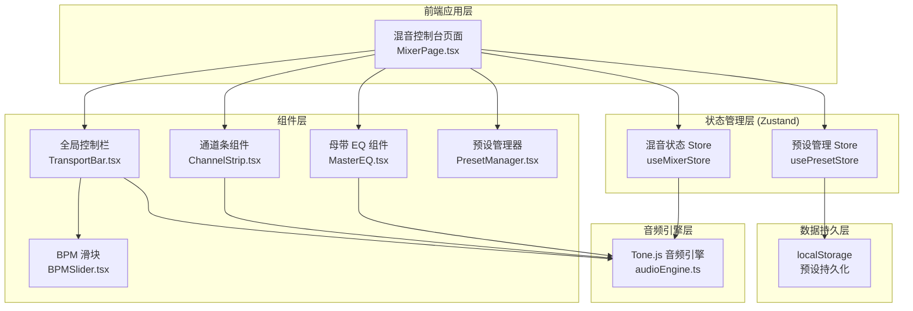

## 1. 架构设计



## 2. 技术描述

- **前端框架**：React@18 + TypeScript
- **样式方案**：Tailwind CSS@3
- **状态管理**：Zustand
- **音频引擎**：Tone.js（提供音频播放、循环、同步、BPM 控制）
- **图标库**：lucide-react
- **构建工具**：Vite
- **项目模板**：react-ts（纯前端项目）
- **本地存储**：localStorage（预设数据）

## 3. 路由定义

本项目为单页面应用，无需路由。

| 路由 | 用途 |
|-----|------|
| / | 混音控制台主页面 |

## 4. 数据模型

### 4.1 音轨数据结构

```typescript
interface TrackState {
  id: string;
  name: string;
  volume: number;        // 0-100 (映射到 -60dB ~ 0dB)
  pan: number;           // -1 (极左) ~ 1 (极右)
  isMuted: boolean;
  isSolo: boolean;
  audioUrl: string;      // 当前使用的音频源 URL
  isCustomAudio: boolean; // 是否为用户自定义音频
}
```

### 4.2 全局状态

```typescript
interface MixerState {
  tracks: TrackState[];
  bpm: number;           // 60-200
  isPlaying: boolean;
  masterEq: {
    lowGain: number;     // -12 ~ 12 dB
    highGain: number;    // -12 ~ 12 dB
  };
}

interface Preset {
  id: string;
  name: string;
  state: Omit<MixerState, 'isPlaying'>;
  createdAt: string;
}
```

## 5. 组件树

```
App
└── MixerPage
    ├── TransportBar
    │   ├── PlayStopButton
    │   ├── BPMSlider
    │   └── MasterEQ
    │       ├── EQKnob (Low Gain)
    │       └── EQKnob (High Gain)
    ├── ChannelArea
    │   └── ChannelStrip × 4
    │       ├── TrackNameLabel
    │       ├── LevelMeter
    │       ├── PanKnob
    │       ├── MuteButton
    │       ├── SoloButton
    │       ├── VolumeFader
    │       └── LoadAudioButton
    └── PresetManager
        ├── PresetSelector
        ├── PresetNameInput
        ├── SaveButton
        └── LoadButton
```

## 6. 音频引擎设计

Tone.js 配置：
- 使用 `Tone.Players` 管理多个音频源
- 每个音轨通过 `Tone.Channel` 处理音量和声相
- 使用 `Tone.Transport.bpm` 控制全局速度
- 母带 EQ 使用 `Tone.EQ3`（低频/高频搁架式滤波器）
- 预设音频循环使用 Tone.js 的 `.loop` 属性自动循环播放